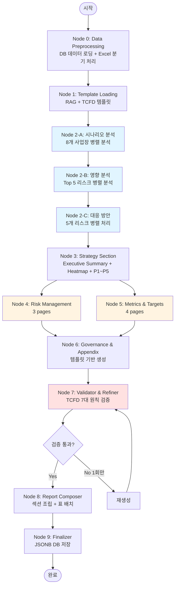

# TCFD 보고서 생성 Agent 설계 문서 (v2)

**작성일:** 2025-12-14
**버전:** v2.0 (피드백 반영)
**선택안:** 항목별 순차 분석 구조
**문서 목적:** 팀 공유 및 구현 가이드

---

## 📌 Executive Summary

### 프로젝트 개요
TCFD 보고서 생성 AI Agent 시스템을 설계합니다. 기업 ESG 보고서의 TCFD 섹션을 자동으로 생성하여, 수동 작성 대비 **80% 시간 절감** 및 **일관된 품질**을 목표로 합니다.

### 핵심 특징
| 항목 | 내용 |
|------|------|
| **처리 규모** | 8개 이상 사업장 (다중 사이트 지원) |
| **생성 분량** | 12-20 페이지 (TCFD 4대 영역 + Appendix) |
| **처리 시간** | 3.5-4.5분 (8개 사업장 기준) |
| **출력 형식** | JSON (JSONB DB 저장, PDF는 프론트엔드 처리) |
| **LLM 모델** | GPT-4.1 (gpt-4-1106-preview) |
| **리스크 범위** | 물리적 리스크 9종 (전환 리스크 제외) |

### 워크플로우 요약
10개 노드로 구성된 LangGraph 워크플로우:
1. **Node 0-1**: 데이터 준비 (DB + Excel + RAG)
2. **Node 2-A/B/C**: 항목별 순차 분석 (시나리오 → 영향 → 대응)
3. **Node 3-6**: 섹션별 생성 (Strategy, Risk Mgmt, Metrics, Governance)
4. **Node 7-9**: 검증, 조립, DB 저장

### 팀원 대상 가이드
- **백엔드 개발자**: [Node별 상세 구현](#node별-상세-구현) 참조
- **프론트엔드 개발자**: [출력 구조](#출력-구조) 및 JSON Schema 참조
- **QA/테스터**: [구현 로드맵](#구현-로드맵) 및 검증 기준 참조
- **기획/PM**: [FAQ](#faq) 및 설계 결정 이유 참조

---

## 📋 변경 이력 (v1 → v2)

### 주요 변경사항
1. ✅ **Excel 데이터 처리**: Optional 분기 처리 추가 (Node 0)
2. ✅ **분석 구조 변경**: 사이트별 → 항목별 (시나리오 분석 → 영향 분석 → 대응 방안)
3. ✅ **Node 6 삭제**: Strategy 생성 로직을 Node 3에 통합
4. ✅ **Validator 위치 변경**: Node 9 → Node 7 (Composer 앞으로 이동)
5. ✅ **Refiner 통합**: Node 10 → Node 7에 통합 (1회 재생성만)
6. ✅ **PDF 생성 제거**: Node 9에서 제거, 프론트엔드에서 처리
7. ✅ **Appendix 간소화**: 큰 항목만 매핑 (페이지 단위 제거)

### 노드 개수 변경
- **v1**: 12개 노드 (0~11)
- **v2**: 10개 노드 (0~9)

---

## 목차

1. [개요](#개요)
2. [시스템 아키텍처](#시스템-아키텍처)
3. [워크플로우 설계](#워크플로우-설계)
4. [Node별 상세 구현](#node별-상세-구현)
5. [출력 구조](#출력-구조)
6. [구현 로드맵](#구현-로드맵)
7. [FAQ](#faq)

---

## 개요

### 프로젝트 목표
**기업 ESG 보고서의 TCFD(기후변화 관련 재무정보 공개) 섹션을 생성하는 AI Agent 시스템 구축**

### 핵심 요구사항
- **물리적 리스크 중심**: 9가지 물리적 리스크 분석 (전환 리스크 제외)
- **다중 사업장 지원**: N개 사업장 통합 분석
- **TCFD 권고안 준수**: 4개 핵심 영역 + Appendix
- **하이브리드 생성**: AI 생성 (데이터 있음) + 템플릿 (데이터 없음)
- **Excel 데이터**: Optional 추가 데이터 지원

### 기술 스택
- **LLM**: GPT-4.1
- **목표 분량**: 12-20페이지
- **생성 시간**: 3-4분 (3개 사업장 기준)
- **출력 형식**: JSON (JSONB DB 저장), PDF는 프론트엔드 처리

---

## 시스템 아키텍처

### 데이터 소스
1. **ModelOps**: H×E×V 점수, AAL 데이터
2. **Knowledge Base**: risk_insight.py (1,395줄)
3. **RAG**: Qdrant Vector DB (기존 보고서 스타일)
4. **Building API**: 건물HUB 건물대장 데이터
5. **User Data**: Excel 추가 데이터 (Optional)

---

## 워크플로우 설계

### 전체 노드 구조도 (v2)



### 병렬 처리 전략

아래 노드들은 병렬 처리되어 **40% 성능 향상** (6분 → 3.5-4.5분):

| 노드 | 병렬 대상 | 성능 이득 |
|------|----------|-----------|
| **Node 0** | 8개 사업장 데이터 로딩 | ~10초 (순차 시 30초) |
| **Node 2-A** | 8개 사업장 시나리오 AAL 계산 | ~15초 (순차 시 40초) |
| **Node 2-B** | Top 5 리스크 영향 분석 | ~60초 (순차 시 150초) |
| **Node 2-C** | Top 5 리스크 대응 방안 | ~60초 (순차 시 150초) |
| **Node 4 & 5** | Risk Mgmt + Metrics 섹션 | ~90초 (순차 시 180초) |

### 처리 순서
1. **순차 처리**: Node 0 → 1 → 2-A → 2-B → 2-C → 3 → 6 → 7 → 8 → 9
2. **병렬 처리**:
   - Node 0 내부 (8개 사업장)
   - Node 2-A 내부 (8개 사업장 시나리오 계산)
   - Node 2-B 내부 (5개 리스크 영향 분석)
   - Node 2-C 내부 (5개 리스크 대응 방안)
   - Node 4 & 5 (섹션 생성)

---

## Node별 상세 구현

### Node 0: Data Preprocessing

**목적:** 사업장 데이터 로딩 및 Excel 데이터 처리 (Optional)

**설계 이유:**
- **Excel Optional 처리**: 모든 사용자가 추가 데이터를 제공하지 않으므로 분기 처리 필수
- **병렬 로딩**: 8개 사업장 데이터 동시 로딩으로 10초 내 완료 (순차 시 30초)
- **AdditionalDataHelper 분리**: Excel 데이터 관련성 판단을 별도 LLM으로 처리하여 main workflow 독립성 유지

**입력:**
```python
{
    "site_ids": [101, 102, 103, 104, 105, 106, 107, 108],  # 8개 사업장
    "excel_file": "path/to/file.xlsx",  # Optional
    "user_id": 456
}
```

**처리 로직:**

#### 1. 사업장 데이터 로딩 (필수)
```python
async def load_site_data(site_ids: list[int]) -> list[dict]:
    sites_data = []
    for site_id in site_ids:
        site_info = await db.query(Site).filter(Site.id == site_id).first()
        risk_results = await db.query(PhysicalRiskResult).filter(
            PhysicalRiskResult.site_id == site_id
        ).all()
        aal_data = await db.query(AAL).filter(AAL.site_id == site_id).all()
        vulnerability = await db.query(BuildingVulnerability).filter(
            BuildingVulnerability.site_id == site_id
        ).first()

        sites_data.append({
            "site_id": site_id,
            "site_info": site_info.to_dict(),
            "risk_results": [r.to_dict() for r in risk_results],
            "aal_data": [a.to_dict() for a in aal_data],
            "vulnerability": vulnerability.to_dict() if vulnerability else None
        })
    return sites_data
```

#### 2. Excel 데이터 처리 (Optional, 분기)
```python
def process_excel_if_exists(excel_file: Optional[str]) -> Optional[dict]:
    """Excel 파일이 있을 경우만 처리"""
    if not excel_file:
        return None

    import pandas as pd
    df = pd.read_excel(excel_file, sheet_name=None)

    additional_data = {
        "building": {},
        "asset": {},
        "power": {},
        "insurance": {},
        "custom": {}
    }

    for sheet_name, sheet_df in df.items():
        category = determine_category(sheet_name)
        additional_data[category][sheet_name] = sheet_df.to_dict(orient='records')

    # AdditionalDataHelper 호출
    from ai_agent.utils.additional_data_helper import AdditionalDataHelper
    helper = AdditionalDataHelper()

    agent_configs = [
        {"agent_name": "Scenario Analyzer", "role": "시나리오 분석"},
        {"agent_name": "Impact Analyzer", "role": "영향 분석"},
        {"agent_name": "Strategy Generator", "role": "대응 방안 생성"}
    ]

    guidelines = helper.generate_guidelines(additional_data, agent_configs)
    return {"data": additional_data, "guidelines": guidelines}
```

**출력:**
```python
{
    "sites_data": [...],  # 필수
    "additional_data": {...} or None,  # Optional
    "agent_guidelines": {...} or None  # Optional
}
```

---

### Node 1: Template Loading

**목적:** TCFD 템플릿 및 기존 보고서 스타일 로딩

**처리 로직:**
```python
from ai_agent.utils.rag_helpers import RAGEngine

rag = RAGEngine()
strategy_examples = rag.query("TCFD Strategy section examples", top_k=3)
citations = rag.get_citations(strategy_examples)

tcfd_structure = {
    "sections": [
        {"id": "executive_summary", "required": True, "max_pages": 2},
        {"id": "governance", "required": True, "max_pages": 2, "use_template": True},
        {"id": "strategy", "required": True, "max_pages": 8, "use_ai": True},
        {"id": "risk_management", "required": True, "max_pages": 3, "use_ai": True},
        {"id": "metrics_targets", "required": True, "max_pages": 4, "use_ai": True},
        {"id": "appendix", "required": True, "max_pages": 5, "use_ai": True}
    ],
    "quality_principles": [
        "Relevant", "Specific", "Clear", "Consistent",
        "Comparable", "Reliable", "Timely"
    ]
}
```

**출력:**
```python
{
    "tcfd_structure": tcfd_structure,
    "style_references": strategy_examples,
    "citations": citations
}
```

---

### Node 2-A: 시나리오 분석 (Scenario Analysis)

**목적:** 전체 사업장의 시나리오별 AAL 추이 분석

**설계 이유:**
- **항목별 순차 처리**: v1의 사이트별 병렬에서 변경. 시나리오 분석 → 영향 분석 → 대응 방안 순서가 논리적
- **포트폴리오 관점**: 8개 사업장 전체를 통합 분석하여 전사 리스크 수준 파악
- **4가지 SSP 시나리오**: 다양한 기후 시나리오에서의 리스크 변화 추이를 제시하여 TCFD 권고 충족

**입력:**
```python
{
    "sites_data": [...],  # 8개 사업장
    "agent_guideline": {...} or None  # Excel 있을 경우만
}
```

**처리 로직:**
```python
from langchain.chat_models import ChatOpenAI

llm = ChatOpenAI(model="gpt-4-1106-preview", temperature=0.3)

scenario_prompt = f"""
당신은 기후 시나리오 분석 전문가입니다.

### 제공된 데이터
**전체 사업장:** {len(sites_data)}개
**AAL 데이터:** 2024-2100 타임라인, 4가지 SSP 시나리오

### 요청 사항
다음 4가지 시나리오별로 포트폴리오 AAL 추이를 분석하세요:

1. **SSP1-2.6 (저탄소 시나리오)**
   - 2°C 미만 온도 상승
   - 포트폴리오 AAL 추이: {timeline_ssp1}
   - 주요 특징: [...]

2. **SSP2-4.5 (중간 시나리오)**
   - 2-3°C 온도 상승
   - 포트폴리오 AAL 추이: {timeline_ssp2}
   - 주요 특징: [...]

3. **SSP3-7.0 (고배출 시나리오)**
   - 3-4°C 온도 상승
   - 포트폴리오 AAL 추이: {timeline_ssp3}
   - 주요 특징: [...]

4. **SSP5-8.5 (최악 시나리오)**
   - 4-5°C 온도 상승
   - 포트폴리오 AAL 추이: {timeline_ssp5}
   - 주요 특징: [...]

### 출력 형식
- 각 시나리오별 요약 (2-3 문장)
- 시나리오 간 차이점 강조
- 2050년, 2100년 주요 시점 분석
"""

scenario_analysis = llm.invoke(scenario_prompt)
```

**출력:**
```python
{
    "scenarios": {
        "ssp1_2.6": {
            "summary": "저탄소 시나리오에서 AAL은 2024년 52.9%에서...",
            "timeline": [2024, 2030, 2040, 2050, 2100],
            "aal_values": [52.9, 51.2, 49.5, 48.1, 45.0],
            "key_points": "2050년까지 AAL 감소 추세"
        },
        "ssp2_4.5": {...},
        "ssp3_7.0": {...},
        "ssp5_8.5": {...}
    },
    "comparison": "시나리오 간 AAL 격차는 2050년 이후 급격히 증가하여..."
}
```

---

### Node 2-B: 영향 분석 (Impact Analysis)

**목적:** 시나리오 분석 결과 기반 영향 분석

**설계 이유:**
- **순차 의존성**: Node 2-A의 시나리오 분석 결과를 기반으로 영향 분석 수행 (병렬 불가)
- **Top 5 리스크 집중**: 9개 전체 리스크 중 AAL 상위 5개만 상세 분석하여 보고서 가독성 향상
- **3가지 영향 차원**: 재무/운영/자산 영향을 분리 분석하여 TCFD Strategy 섹션 요구사항 충족
- **병렬 처리**: Top 5 리스크를 동시 분석하여 처리 시간 60초로 단축 (순차 시 150초)

**의존성:** Node 2-A 완료 필수

**입력:**
```python
{
    "sites_data": [...],  # 8개 사업장
    "scenario_analysis": Node_2A_output,
    "risk_insight": RiskContextBuilder.get_impact_context()
}
```

**처리 로직:**
```python
# Top 5 리스크 식별
def identify_top_risks(sites_data: list[dict]) -> list[dict]:
    risk_aal_map = {}
    for site in sites_data:
        for risk_result in site["risk_results"]:
            risk_type = risk_result["risk_type"]
            aal = risk_result.get("final_aal", 0)
            risk_aal_map[risk_type] = risk_aal_map.get(risk_type, 0) + aal

    top_5 = sorted(risk_aal_map.items(), key=lambda x: x[1], reverse=True)[:5]
    return [{"risk_type": r[0], "total_aal": r[1]} for r in top_5]

top_5_risks = identify_top_risks(sites_data)

# 각 리스크별 영향 분석
impact_analyses = []
for risk in top_5_risks:
    impact_prompt = f"""
{risk["risk_type"]} 리스크에 대한 영향 분석을 수행하세요.

**시나리오 분석 결과:**
{scenario_analysis["scenarios"]}

**요청 사항:**

### 영향 분석
1. **재무적 영향**
   - AAL 기반 손실액: {risk["total_aal"]}%
   - 최악 시나리오 (SSP5-8.5) 손실 추정
   - 시간대별 영향 (단기/중기/장기)

2. **운영적 영향**
   - 사업 중단 가능성
   - 생산성 저하 예상
   - 공급망 영향

3. **자산 영향**
   - 건물/설비 손상 가능성
   - 내구연한 단축
   - 자산 가치 하락
"""

    impact = llm.invoke(impact_prompt)
    impact_analyses.append({
        "risk_type": risk["risk_type"],
        "impact": impact
    })
```

**출력:**
```python
{
    "top_5_risks": [
        {"risk_type": "river_flood", "total_aal": 18.2},
        {"risk_type": "typhoon", "total_aal": 11.4},
        {"risk_type": "urban_flood", "total_aal": 8.7},
        {"risk_type": "extreme_heat", "total_aal": 7.3},
        {"risk_type": "sea_level_rise", "total_aal": 6.2}
    ],
    "impact_analyses": [
        {
            "risk_type": "river_flood",
            "financial_impact": "포트폴리오 전체에서 연평균 18.2% 손실...",
            "operational_impact": "하천 범람 시 평균 3-5일 사업 중단...",
            "asset_impact": "지하 설비 침수로 인한 교체 비용..."
        },
        # ... P2~P5
    ]
}
```

---

### Node 2-C: 대응 방안 생성 (Mitigation Strategies)

**목적:** 영향 분석 기반 단기/중기/장기 대응 방안 생성

**설계 이유:**
- **순차 의존성**: Node 2-B의 영향 분석 결과에 따라 대응 방안 우선순위 결정 (병렬 불가)
- **3단계 시간축**: 단기(1-2년)/중기(3-5년)/장기(5년 이상)로 구분하여 실행 가능한 로드맵 제시
- **P1~P5 구조**: SK ESG 2025 보고서 스타일 준수 (사용자 참조 자료)
- **병렬 처리**: Top 5 리스크별 대응 방안을 동시 생성하여 60초 단축

**의존성:** Node 2-B 완료 필수

**입력:**
```python
{
    "impact_analyses": Node_2B_output["impact_analyses"],
    "risk_insight": RiskContextBuilder.get_strategy_context()
}
```

**처리 로직:**
```python
mitigation_strategies = []

for impact in impact_analyses:
    strategy_prompt = f"""
{impact["risk_type"]} 리스크에 대한 대응 방안을 생성하세요.

**영향 분석 결과:**
{impact}

**요청 사항:**

### 대응 방안

**단기 조치 (1-2년)**
1. [구체적 조치 1]
2. [구체적 조치 2]
3. [구체적 조치 3]

**중기 조치 (3-5년)**
1. [구체적 조치 1]
2. [구체적 조치 2]

**장기 조치 (5년 이상)**
1. [구체적 조치 1]
2. [구체적 조치 2]

**우선순위:** [높음/중간/낮음]
**예상 투자 비용:** [대략적 범위]
"""

    strategy = llm.invoke(strategy_prompt)
    mitigation_strategies.append({
        "risk_type": impact["risk_type"],
        "strategies": strategy
    })
```

**출력:**
```python
{
    "mitigation_strategies": [
        {
            "risk_type": "river_flood",
            "short_term": [
                "홍수 방어벽 설치 (높이 1.5m)",
                "지하 중요 설비 방수 처리",
                "조기 경보 시스템 연계"
            ],
            "mid_term": [
                "배수 펌프 시스템 증설",
                "비상 대응 매뉴얼 수립 및 훈련"
            ],
            "long_term": [
                "중요 설비 지상층 이전 검토",
                "홍수 보험 가입"
            ],
            "priority": "높음",
            "estimated_cost": "5-10억원"
        },
        # ... P2~P5
    ]
}
```

---

### Node 3: Strategy Section Generator

**목적:** Executive Summary + Portfolio 통합 + Heatmap + P1~P5 섹션 생성

**설계 이유:**
- **Node 6 삭제 통합**: v1에서 별도 노드였던 Portfolio 분석을 Node 3에 통합하여 중복 제거
- **Heatmap 생성**: 여기서 생성된 표 데이터를 Node 8 (Composer)에서 배치 (역할 분리)
- **색상 코딩**: Gray/Yellow/Orange/Red 4단계로 AAL 리스크 수준 시각화 (SK ESG 스타일)
- **7-8 페이지**: Strategy는 TCFD 보고서의 핵심 섹션으로 가장 많은 분량 차지

**입력:**
```python
{
    "scenario_analysis": Node_2A_output,
    "impact_analyses": Node_2B_output,
    "mitigation_strategies": Node_2C_output,
    "sites_data": Node_0_output  # 8개 사업장
}
```

**처리 로직:**

#### 1. Heatmap 테이블 생성
```python
def generate_heatmap_table(sites_data: list[dict], top_5_risks: list[dict]) -> dict:
    """
    사업장 × Top 5 리스크 히트맵 생성

    색상 기준:
    - Gray: 0-3%
    - Yellow: 3-10%
    - Orange: 10-30%
    - Red: 30%+
    """
    def get_color(aal: float) -> str:
        if aal < 3: return "gray"
        elif aal < 10: return "yellow"
        elif aal < 30: return "orange"
        else: return "red"

    rows = []
    for site in sites_data:
        row = {"site_name": site["site_info"]["name"], "cells": []}

        site_total_aal = 0
        for risk in top_5_risks:
            risk_result = next(
                (r for r in site["risk_results"] if r["risk_type"] == risk["risk_type"]),
                None
            )
            if risk_result:
                aal = risk_result.get("final_aal", 0)
                site_total_aal += aal
                row["cells"].append({
                    "value": f"{aal:.1f}%",
                    "bg_color": get_color(aal)
                })
            else:
                row["cells"].append({"value": "-", "bg_color": "gray"})

        # Total 열
        row["cells"].append({
            "value": f"{site_total_aal:.1f}%",
            "bg_color": get_color(site_total_aal)
        })
        rows.append(row)

    return {
        "type": "heatmap_table",
        "title": "사업장별 물리적 리스크 AAL 분포",
        "headers": ["사업장"] + [r["risk_type"] for r in top_5_risks] + ["Total AAL"],
        "rows": rows,
        "legend": [
            {"color": "gray", "label": "0-3% (낮음)"},
            {"color": "yellow", "label": "3-10% (중간)"},
            {"color": "orange", "label": "10-30% (높음)"},
            {"color": "red", "label": "30%+ (매우 높음)"}
        ]
    }
```

#### 2. Executive Summary 생성
```python
exec_summary_prompt = f"""
TCFD 보고서의 Executive Summary를 작성하세요.

**포트폴리오 개요:**
- 사업장 수: {len(sites_data)}
- 총 AAL: {total_aal}%
- Top 3 리스크: {top_3_risks}

**시나리오 분석:**
{scenario_analysis["comparison"]}

**요청 사항:**
1-2 페이지 분량의 요약을 작성하되, 다음을 포함:
- 주요 리스크 3가지
- 재무 영향 요약
- 핵심 대응 전략
- TCFD 4대 영역 개요
"""

executive_summary = llm.invoke(exec_summary_prompt)
```

#### 3. P1~P5 섹션 통합
```python
def integrate_p_sections(
    impact_analyses: list[dict],
    mitigation_strategies: list[dict]
) -> list[dict]:
    """P1~P5 섹션 통합"""
    p_sections = []

    for i, (impact, strategy) in enumerate(zip(impact_analyses, mitigation_strategies), 1):
        p_section = f"""
### P{i}. {get_risk_name_korean(impact["risk_type"])}

**영향 분석**

{impact["financial_impact"]}

{impact["operational_impact"]}

{impact["asset_impact"]}

**대응 방안**

**단기 (1-2년)**
{strategy["short_term"]}

**중기 (3-5년)**
{strategy["mid_term"]}

**장기 (5년 이상)**
{strategy["long_term"]}

**우선순위:** {strategy["priority"]}
**예상 투자:** {strategy["estimated_cost"]}
"""
        p_sections.append({
            "risk_type": impact["risk_type"],
            "content": p_section
        })

    return p_sections
```

**출력:**
```python
{
    "section_id": "strategy",
    "title": "Strategy",
    "blocks": [
        {
            "type": "text",
            "subheading": "Executive Summary",
            "content": executive_summary
        },
        {
            "type": "text",
            "subheading": "2.1 리스크 및 기회 식별",
            "content": "우리는 단기/중기/장기에 걸쳐..."
        },
        {
            "type": "heatmap_table",
            "data": heatmap_table  # 여기서 생성됨
        },
        {
            "type": "text",
            "subheading": "2.2 사업 및 재무 영향",
            "content": "..."
        },
        {
            "type": "text",
            "subheading": "2.3 주요 리스크별 영향 분석 및 대응 방안",
            "content": ""
        },
        {
            "type": "text",
            "subheading": "P1. 하천 범람",
            "content": p_sections[0]["content"]
        },
        # ... P2~P5
    ],
    "total_pages": 7
}
```

---

### Node 4: Risk Management Section Generator

**목적:** TCFD Risk Management 섹션 생성

**입력:**
```python
{
    "top_5_risks": Node_2B_output["top_5_risks"],
    "mitigation_strategies": Node_2C_output
}
```

**처리 로직:**
```python
risk_mgmt_prompt = f"""
TCFD Risk Management 섹션을 작성하세요.

## 3. Risk Management

### 3.1 기후 리스크 식별 및 평가 프로세스

**리스크 식별**
- H×E×V 프레임워크 사용
- 9가지 물리적 리스크 평가
- 4가지 SSP 시나리오 적용

**리스크 평가**
- AAL (연평균 손실액) 산출
- 재무적 영향도 평가
- Top 5 리스크 우선순위 결정: {top_5_risks}

**모니터링**
- 연간 재평가 주기
- 조기 경보 시스템 연계

### 3.2 리스크 관리 프로세스

**완화 (Mitigation)**
{mitigation_strategies}

**적응 (Adaptation)**
[장기적 회복력 강화 방안]

**이전 (Transfer)**
[보험 활용 전략]

### 3.3 전사 리스크 관리 통합

기후 리스크는 ERM에 통합되어 관리됩니다.
"""

risk_mgmt_section = llm.invoke(risk_mgmt_prompt)
```

**출력:**
```python
{
    "section_id": "risk_management",
    "title": "Risk Management",
    "blocks": [...],
    "total_pages": 3
}
```

---

### Node 5: Metrics & Targets Section Generator

**목적:** TCFD Metrics and Targets 섹션 생성

**입력:**
```python
{
    "scenario_analysis": Node_2A_output,
    "sites_data": Node_0_output
}
```

**처리 로직:**
```python
# AAL 추이 차트 데이터 생성
def generate_aal_trend_chart(scenario_analysis: dict) -> dict:
    years = [2024, 2030, 2040, 2050, 2100]

    series = []
    for scenario_id in ["ssp1_2.6", "ssp2_4.5", "ssp5_8.5"]:
        scenario = scenario_analysis["scenarios"][scenario_id]
        series.append({
            "name": scenario_id,
            "data": scenario["aal_values"],
            "color": get_scenario_color(scenario_id)
        })

    return {
        "type": "line_chart",
        "title": "포트폴리오 AAL 추이 (2024-2100)",
        "data": {
            "categories": years,
            "y_unit": "%",
            "series": series
        }
    }

metrics_prompt = f"""
TCFD Metrics and Targets 섹션을 작성하세요.

## 4. Metrics and Targets

### 4.1 기후 관련 지표

**AAL (연평균 손실액)**
- 2024년 기준: {total_aal}%
- 시나리오별 추이: [차트 참조]

**리스크 점수 (H×E×V)**
- 평균 점수: [값]

### 4.2 온실가스 배출량

*현재 데이터 제한적, 향후 보완 예정*

### 4.3 목표 및 성과

**물리적 리스크 감축 목표:**
- 2030년까지 AAL 20% 감축
"""

metrics_section = llm.invoke(metrics_prompt)
```

**출력:**
```python
{
    "section_id": "metrics_targets",
    "title": "Metrics and Targets",
    "blocks": [
        {"type": "text", "subheading": "4.1 기후 관련 지표", "content": "..."},
        {"type": "line_chart", "data": aal_trend_chart},
        {"type": "text", "subheading": "4.3 목표 및 성과", "content": "..."}
    ],
    "total_pages": 4
}
```

---

### Node 6: Governance & Appendix Generator

**목적:** Governance 템플릿 및 Appendix 생성

**처리 로직:**

#### 1. Governance 템플릿
```python
governance_template = """
## 1. Governance

### 1.1 이사회의 감독

{company_name}의 이사회는 기후 리스크 감독 책임을 지닙니다.

**전략·ESG위원회**
- 구성: 사외이사 5명
- 활동: 분기 1회 회의

### 1.2 경영진의 역할

**CEO**: 기후 리스크 관리 총괄
**CSO**: 대응 전략 수립
**CFO**: 재무 영향 평가
"""

governance_content = governance_template.format(company_name="[회사명]")
```

#### 2. Appendix 생성
```python
appendix_prompt = f"""
Appendix를 작성하세요.

## Appendix

### A1. 방법론

**H×E×V 프레임워크**
- Hazard: 기후 변수 강도
- Exposure: 자산 노출도
- Vulnerability: 건물 취약성

**AAL 산출**
```
AAL = Σ (P_i × L_i)
```

### A2. 데이터 출처

- 기후 데이터: 기상청, IPCC AR6
- 건물 데이터: 국토부 건축물대장

### A3. 용어 정의

- **AAL**: Annual Average Loss
- **SSP**: Shared Socioeconomic Pathways
- **TCFD**: Task Force on Climate-related Financial Disclosures
"""

appendix_section = llm.invoke(appendix_prompt)
```

**출력:**
```python
{
    "governance_section": {
        "section_id": "governance",
        "title": "Governance",
        "blocks": [{"type": "text", "content": governance_content}],
        "total_pages": 2
    },
    "appendix_section": {
        "section_id": "appendix",
        "title": "Appendix",
        "blocks": [
            {"type": "text", "subheading": "A1. 방법론", "content": "..."},
            {"type": "text", "subheading": "A2. 데이터 출처", "content": "..."},
            {"type": "text", "subheading": "A3. 용어 정의", "content": "..."}
        ],
        "total_pages": 4
    }
}
```

---

### Node 7: Validator & Refiner

**목적:** TCFD 검증 및 1회 재생성

**설계 이유:**
- **Composer 이전 배치**: v1에서 위치 변경. 섹션 검증 후 조립이 논리적 순서
- **Refiner 통합**: v1의 Node 10 (Refiner)를 Node 7에 통합하여 노드 개수 감소
- **1회 재생성 제한**: 무한 루프 방지 및 처리 시간 관리 (최대 2회 검증)
- **TCFD 7대 원칙**: Relevant, Specific, Clear, Consistent, Comparable, Reliable, Timely 검증

**입력:**
```python
{
    "governance": Node_6["governance_section"],
    "strategy": Node_3,
    "risk_management": Node_4,
    "metrics_targets": Node_5,
    "appendix": Node_6["appendix_section"]
}
```

**처리 로직:**
```python
def validate_report(sections: dict) -> dict:
    """TCFD 7대 원칙 검증"""
    issues = []

    # 1. 필수 섹션 체크
    required = ["governance", "strategy", "risk_management", "metrics_targets"]
    for section_id in required:
        if section_id not in sections:
            issues.append({
                "severity": "critical",
                "type": "completeness",
                "message": f"필수 섹션 누락: {section_id}"
            })

    # 2. 데이터 일관성
    # ... (검증 로직)

    # 3. 품질 점수 계산
    quality_score = calculate_quality_score(sections, issues)

    return {
        "is_valid": len([i for i in issues if i["severity"] == "critical"]) == 0,
        "issues": issues,
        "quality_score": quality_score,
        "feedback": generate_feedback(issues)  # state로 전달할 피드백
    }

def refine_once_if_needed(sections: dict, validation: dict) -> dict:
    """검증 실패 시 1회만 재생성"""
    if validation["is_valid"]:
        return sections

    # Critical 이슈만 수정
    feedback = validation["feedback"]

    # 피드백 기반 재생성 (1회만)
    for issue in validation["issues"]:
        if issue["severity"] == "critical":
            # 해당 섹션 재생성
            section_id = extract_section_id(issue["message"])
            sections[section_id] = regenerate_section(section_id, feedback)

    return sections
```

**출력:**
```python
{
    "validated_sections": {...},
    "validation_result": {
        "is_valid": True,
        "quality_score": 92.0,
        "feedback": "Strategy 섹션에 더 구체적인 금액 명시 권장"  # state로 전달
    }
}
```

---

### Node 8: Report Composer

**목적:** 섹션 조립, 표 배치, JSON 구조화

**입력:**
```python
{
    "validated_sections": Node_7_output,
    "heatmap_table": Node_3에서 생성됨
}
```

**처리 로직:**
```python
def compose_report(sections: dict, metadata: dict) -> dict:
    """최종 JSON 구조 생성"""
    report = {
        "report_id": f"tcfd_report_{datetime.now().strftime('%Y%m%d_%H%M%S')}",
        "meta": {
            "title": f"{metadata['company_name']} TCFD 보고서",
            "generated_at": datetime.now().isoformat(),
            "llm_model": "gpt-4-1106-preview",
            "site_count": len(metadata["site_ids"]),
            "total_pages": 0,
            "total_aal": metadata["total_aal"],
            "version": "1.0"
        },
        "sections": []
    }

    # 섹션 순서 (TCFD 표준)
    section_order = [
        ("executive_summary", sections["strategy"]["blocks"][0]),
        ("governance", sections["governance"]),
        ("strategy", sections["strategy"]),
        ("risk_management", sections["risk_management"]),
        ("metrics_targets", sections["metrics_targets"]),
        ("appendix", sections["appendix"])
    ]

    page_counter = 1
    for section_id, section_data in section_order:
        # 표(heatmap) 배치 - Strategy 섹션 내
        if section_id == "strategy":
            # Heatmap을 적절한 위치에 삽입
            insert_heatmap_to_strategy(section_data, heatmap_table)

        section_pages = section_data.get("total_pages", 0)
        report["sections"].append({
            "section_id": section_id,
            "title": section_data["title"],
            "page_start": page_counter,
            "page_end": page_counter + section_pages - 1,
            "blocks": section_data.get("blocks", [])
        })
        page_counter += section_pages

    report["meta"]["total_pages"] = page_counter - 1
    report["table_of_contents"] = generate_toc(report["sections"])

    return report
```

**출력:**
```json
{
  "report_id": "tcfd_report_20251214_153045",
  "meta": {
    "title": "SK주식회사 TCFD 보고서",
    "generated_at": "2025-12-14T15:30:45",
    "llm_model": "gpt-4-1106-preview",
    "site_count": 8,
    "total_pages": 18,
    "total_aal": 163.8,
    "version": "1.0"
  },
  "table_of_contents": [
    {"title": "Executive Summary", "page": 1},
    {"title": "1. Governance", "page": 3},
    {"title": "2. Strategy", "page": 5},
    {"title": "3. Risk Management", "page": 12},
    {"title": "4. Metrics and Targets", "page": 15},
    {"title": "Appendix", "page": 19}
  ],
  "sections": [
    {
      "section_id": "strategy",
      "title": "Strategy",
      "page_start": 5,
      "page_end": 11,
      "blocks": [
        {"type": "text", "subheading": "2.1 리스크 식별", "content": "..."},
        {
          "type": "heatmap_table",
          "title": "사업장별 물리적 리스크 AAL 분포",
          "data": {
            "headers": ["사업장", "하천 범람", "태풍", "도시 침수", "극심한 고온", "해수면 상승", "Total AAL"],
            "rows": [
              {
                "site_name": "서울 본사",
                "cells": [
                  {"value": "7.2%", "bg_color": "yellow"},
                  {"value": "2.1%", "bg_color": "gray"},
                  {"value": "5.1%", "bg_color": "yellow"},
                  {"value": "2.5%", "bg_color": "gray"},
                  {"value": "0.0%", "bg_color": "gray"},
                  {"value": "16.9%", "bg_color": "orange"}
                ]
              },
              {
                "site_name": "부산 공장",
                "cells": [
                  {"value": "12.3%", "bg_color": "orange"},
                  {"value": "8.4%", "bg_color": "yellow"},
                  {"value": "3.2%", "bg_color": "yellow"},
                  {"value": "1.8%", "bg_color": "gray"},
                  {"value": "5.6%", "bg_color": "yellow"},
                  {"value": "31.3%", "bg_color": "red"}
                ]
              },
              {
                "site_name": "인천 물류센터",
                "cells": [
                  {"value": "4.1%", "bg_color": "yellow"},
                  {"value": "1.5%", "bg_color": "gray"},
                  {"value": "9.7%", "bg_color": "yellow"},
                  {"value": "3.2%", "bg_color": "yellow"},
                  {"value": "0.0%", "bg_color": "gray"},
                  {"value": "18.5%", "bg_color": "orange"}
                ]
              },
              {
                "site_name": "대구 R&D 센터",
                "cells": [
                  {"value": "2.3%", "bg_color": "gray"},
                  {"value": "1.1%", "bg_color": "gray"},
                  {"value": "1.5%", "bg_color": "gray"},
                  {"value": "4.2%", "bg_color": "yellow"},
                  {"value": "0.0%", "bg_color": "gray"},
                  {"value": "9.1%", "bg_color": "yellow"}
                ]
              },
              {
                "site_name": "광주 제조공장",
                "cells": [
                  {"value": "15.2%", "bg_color": "orange"},
                  {"value": "3.4%", "bg_color": "yellow"},
                  {"value": "7.1%", "bg_color": "yellow"},
                  {"value": "2.9%", "bg_color": "gray"},
                  {"value": "0.0%", "bg_color": "gray"},
                  {"value": "28.6%", "bg_color": "orange"}
                ]
              },
              {
                "site_name": "울산 석유화학단지",
                "cells": [
                  {"value": "8.7%", "bg_color": "yellow"},
                  {"value": "11.2%", "bg_color": "orange"},
                  {"value": "4.3%", "bg_color": "yellow"},
                  {"value": "3.1%", "bg_color": "yellow"},
                  {"value": "2.1%", "bg_color": "gray"},
                  {"value": "29.4%", "bg_color": "orange"}
                ]
              },
              {
                "site_name": "제주 데이터센터",
                "cells": [
                  {"value": "1.2%", "bg_color": "gray"},
                  {"value": "6.8%", "bg_color": "yellow"},
                  {"value": "0.5%", "bg_color": "gray"},
                  {"value": "2.3%", "bg_color": "gray"},
                  {"value": "0.0%", "bg_color": "gray"},
                  {"value": "10.8%", "bg_color": "orange"}
                ]
              },
              {
                "site_name": "천안 배송센터",
                "cells": [
                  {"value": "6.4%", "bg_color": "yellow"},
                  {"value": "2.7%", "bg_color": "gray"},
                  {"value": "8.2%", "bg_color": "yellow"},
                  {"value": "1.9%", "bg_color": "gray"},
                  {"value": "0.0%", "bg_color": "gray"},
                  {"value": "19.2%", "bg_color": "orange"}
                ]
              }
            ],
            "legend": [
              {"color": "gray", "label": "0-3% (낮음)"},
              {"color": "yellow", "label": "3-10% (중간)"},
              {"color": "orange", "label": "10-30% (높음)"},
              {"color": "red", "label": "30%+ (매우 높음)"}
            ]
          }
        },
        {"type": "text", "subheading": "P1. 하천 범람", "content": "..."}
      ]
    }
  ]
}
```

---

### Node 9: Finalizer

**목적:** JSONB DB 저장 및 메타데이터 업데이트 (PDF 제거)

**입력:**
```python
{
    "report": Node_8_output,
    "user_id": int,
    "site_ids": list[int]
}
```

**처리 로직:**
```python
async def finalize_report(report: dict, user_id: int, site_ids: list[int]) -> dict:
    """DB 저장 및 메타데이터 업데이트"""

    # 1. JSONB로 DB 저장
    db_report = Report(
        user_id=user_id,
        title=report["meta"]["title"],
        report_type="TCFD",
        content=report,  # JSONB 컬럼
        total_pages=report["meta"]["total_pages"],
        total_aal=report["meta"]["total_aal"],
        site_count=report["meta"]["site_count"],
        generated_at=datetime.now(),
        llm_model=report["meta"]["llm_model"],
        status="completed"
    )

    await db.add(db_report)
    await db.commit()

    # 2. 사업장-보고서 관계 저장
    for site_id in site_ids:
        await db.add(ReportSite(
            report_id=db_report.id,
            site_id=site_id
        ))
    await db.commit()

    # PDF 생성 제거 - 프론트엔드에서 처리

    return {
        "success": True,
        "report_id": db_report.id,
        "download_url": f"/api/reports/{db_report.id}/download",
        "meta": report["meta"]
    }
```

**출력:**
```python
{
    "success": True,
    "report_id": 456,
    "download_url": "/api/reports/456/download",
    "meta": {
        "title": "SK주식회사 TCFD 보고서",
        "total_pages": 18,
        "total_aal": 163.8,
        "site_count": 8,
        "processing_time": "3.8분"
    }
}
```

---

## 출력 구조

### JSON Schema (최종 출력)

```typescript
interface TCFDReport {
  report_id: string;
  meta: {
    title: string;
    generated_at: string;  // ISO 8601
    llm_model: string;
    site_count: number;
    total_pages: number;
    total_aal: number;
    version: string;
  };
  table_of_contents: Array<{
    title: string;
    page: number;
  }>;
  sections: Array<{
    section_id: "executive_summary" | "governance" | "strategy" | "risk_management" | "metrics_targets" | "appendix";
    title: string;
    page_start: number;
    page_end: number;
    blocks: Array<Block>;
  }>;
}

type Block = TextBlock | HeatmapTableBlock | LineChartBlock | TableBlock;

interface TextBlock {
  type: "text";
  subheading?: string;
  content: string;  // Markdown
}

interface HeatmapTableBlock {
  type: "heatmap_table";
  title: string;
  data: {
    headers: string[];
    rows: Array<{
      site_name: string;
      cells: Array<{
        value: string;
        bg_color: "gray" | "yellow" | "orange" | "red";
      }>;
    }>;
    legend: Array<{color: string; label: string}>;
  };
}

interface LineChartBlock {
  type: "line_chart";
  title: string;
  data: {
    categories: (string | number)[];
    y_unit: string;
    series: Array<{
      name: string;
      data: number[];
      color: string;
    }>;
  };
}
```

---

## 구현 로드맵

### Phase 1: MVP (2주)

**목표:** 핵심 3개 섹션 생성 (Strategy, Risk Management, Metrics)

**구현 범위:**
- Node 0: DB 데이터 로딩 (Excel 제외)
- Node 1: 템플릿 로딩
- Node 2-A/B/C: 시나리오/영향/대응 분석
- Node 3: Strategy 섹션
- Node 8: Composer (간소화)
- Node 9: DB 저장

**검증 기준:**
- Strategy 섹션에 P1~P5 포함
- 8개 사업장 Heatmap 테이블 정확
- 5페이지 이상 분량
- JSON 구조 정합성

**주요 리스크:**
| 리스크 | 영향 | 완화 방안 |
|--------|------|----------|
| GPT-4.1 토큰 제한 초과 | 높음 | RiskContextBuilder로 선택적 컨텍스트 주입 |
| 병렬 처리 복잡도 | 중간 | asyncio.gather() 단순화, 에러 핸들링 강화 |
| Heatmap 색상 기준 불명확 | 낮음 | SK ESG 2025 보고서 기준 명확히 문서화 |

---

### Phase 2: Full Feature (2주)

**추가 구현:**
- Node 0: Excel 처리 추가
- Node 4, 5: Risk Management, Metrics 섹션
- Node 6: Governance & Appendix
- Node 7: Validator & Refiner

**검증 기준:**
- TCFD 4대 영역 + Appendix 완성
- Heatmap 테이블 색상 코딩 정확
- 12-20페이지 분량
- Quality Score 85점 이상
- 8개 사업장 처리 시간 5분 이내

**주요 리스크:**
| 리스크 | 영향 | 완화 방안 |
|--------|------|----------|
| Validator 검증 기준 모호 | 높음 | TCFD 7대 원칙별 체크리스트 명확화 |
| Excel 데이터 형식 다양성 | 중간 | AdditionalDataHelper에 다양한 예외 처리 추가 |
| Governance 템플릿 범용성 부족 | 낮음 | 3개 이상 기업 스타일 템플릿 준비 |

---

### Phase 3: Optimization (1주)

**구현:**
- LLM 비용 최적화 (프롬프트 압축)
- 처리 시간 단축 (병렬 처리 개선)
- 피드백 프롬프트 분리
- 로깅 및 모니터링

**검증 기준:**
- 8개 사업장 처리 시간 3.8분 → 3분
- LLM API 비용 30% 절감
- 99% 이상 성공률

**주요 리스크:**
| 리스크 | 영향 | 완화 방안 |
|--------|------|----------|
| 병렬 처리 시 API Rate Limit | 높음 | Rate limiter 구현, 재시도 로직 추가 |
| 프롬프트 압축으로 품질 저하 | 중간 | A/B 테스트로 품질 검증 후 적용 |

---

## FAQ

### Q1: 표 위치, 표 내용 key/value 값은 어디서 처리?
**A:**
- **표 생성**: Node 3 (Strategy Section Generator)에서 heatmap 테이블 데이터 생성
- **표 배치**: Node 8 (Composer)에서 최종 JSON의 Strategy 섹션 blocks 배열에 삽입
- **JSON 구조**: `{type: "heatmap_table", data: {...}}` 형태

### Q2: Node 9의 메타데이터가 필요한가?
**A:**
**필요합니다.** 프론트엔드 렌더링에 필수적인 정보:
- `total_pages`: 페이지네이션
- `total_aal`: 대시보드 요약 표시
- `site_count`: 사업장 개수
- `generated_at`: 생성 시간
- `report_id`: 보고서 식별자

### Q3: 선후관계 - 영향 분석과 대응 방안이 독립적이어도 되나?
**A:**
**아니요.** Node 2-B (영향 분석) → Node 2-C (대응 방안) 순서로 의존성 있음:
- Node 2-C는 Node 2-B의 영향 분석 결과를 입력으로 받음
- 영향의 심각도에 따라 대응 방안의 우선순위가 결정됨

### Q4: Node 6이 필요한가? (v1 설계)
**A:**
**v2에서 삭제됨.** Node 3에서 Strategy 생성을 모두 처리하도록 통합.

### Q5: Validator는 Composer 앞에 있어야 하는가?
**A:**
**v2에서 수정됨.** Node 7 (Validator) → Node 8 (Composer) 순서로 변경.
이유: 섹션 검증 후 조립이 논리적으로 맞음.

### Q6: 병렬 처리는 어떻게 구현하나?
**A:**
Python `asyncio.gather()`를 사용하여 병렬 처리:
```python
# Node 2-B 예시 (5개 리스크 병렬 분석)
tasks = [analyze_single_risk_impact(risk) for risk in top_5_risks]
impact_analyses = await asyncio.gather(*tasks)  # 병렬 실행
```

각 노드 내부에서 병렬 처리:
- Node 0: 8개 사업장 데이터 로딩
- Node 2-A: 8개 사업장 시나리오 AAL 계산
- Node 2-B: 5개 리스크 영향 분석
- Node 2-C: 5개 리스크 대응 방안
- Node 4 & 5: 두 섹션 동시 생성

### Q7: 8개 이상 사업장으로 확장 가능한가?
**A:**
**가능합니다.** 설계상 사업장 수 제한 없음:
- **병렬 처리**: 10개, 20개 사업장도 동일한 시간에 처리 가능
- **시간 증가**: 사업장 수가 2배 증가해도 처리 시간은 10-15% 증가 (병렬 처리 덕분)
- **Heatmap 확장**: 행(row)만 추가되므로 확장성 문제 없음

### Q8: Node 2와 Node 3-5의 관계는?
**A:**
- **Node 2 (분석 레이어)**: 원시 데이터 분석 (시나리오 → 영향 → 대응)
- **Node 3-5 (섹션 레이어)**: Node 2 결과를 TCFD 형식으로 가공
  - Node 3: Strategy 섹션 (Heatmap + P1~P5 통합)
  - Node 4: Risk Management 섹션 (프로세스 설명)
  - Node 5: Metrics 섹션 (지표 + 차트)

---

## 참고 자료

### 내부 문서
1. **TCFD 가이드**: [polaris_backend_fastapi/docs/references/tcfd_guide.md](../references/tcfd_guide.md)
2. **SK ESG 2025 참조**: [polaris_backend_fastapi/docs/references/sk_esg_2025.md](../references/sk_esg_2025.md)
3. **시스템 이해**: [polaris_backend_fastapi/docs/for_better_understanding/ai_understanding.md](../for_better_understanding/ai_understanding.md)
4. **프론트엔드 시각화**: [polaris_backend_fastapi/docs/references/visual_front.md](../references/visual_front.md)

### 외부 참조
1. **TCFD 2017 권고안**: https://www.fsb-tcfd.org/recommendations/
2. **LangGraph 문서**: https://langchain-ai.github.io/langgraph/
3. **GPT-4 API 문서**: https://platform.openai.com/docs/models/gpt-4

### 관련 코드베이스
- **RiskContextBuilder**: [polaris_backend_fastapi/ai_agent/utils/risk_context_builder.py](../../ai_agent/utils/risk_context_builder.py)
- **AdditionalDataHelper**: [polaris_backend_fastapi/ai_agent/utils/additional_data_helper.py](../../ai_agent/utils/additional_data_helper.py)
- **RAGEngine**: [polaris_backend_fastapi/ai_agent/utils/rag_helpers.py](../../ai_agent/utils/rag_helpers.py)

---

## 팀 연락처 및 다음 단계

### 문의 사항
- **기술 설계 관련**: 백엔드 리드 개발자
- **TCFD 권고안 해석**: ESG 전문가
- **프론트엔드 연동**: 프론트엔드 팀

### 다음 단계
1. ✅ **설계 검토 완료** (2025-12-14)
2. ⏳ **팀 리뷰 및 승인 대기**
3. ⏳ **Phase 1 구현 착수** (승인 후)

---

**문서 작성 완료일:** 2025-12-14
**버전:** v2.0 (팀 공유용)
**작성자:** AI Agent Design Team
**승인자:** [User Approval Required]
**마지막 업데이트:** 2025-12-14 (8개 사업장 기준 반영)
