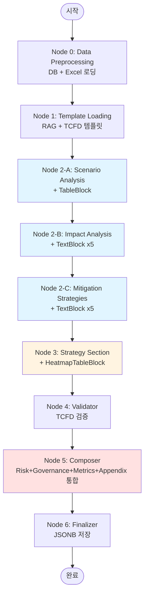

# TCFD 보고서 생성 Agent 설계 문서 (v3)

**작성일:** 2025-12-15
**버전:** v3.0 (7-Node Refactoring)
**이전 버전:** [report_plan_v2.md](report_plan_v2.md) (10-node, deprecated)

---

## 📌 Executive Summary

### 변경 사항 (v2 → v3)
- **노드 개수**: 10개 → **7개**
- **통합**: Node 4, 5, 6, 8 → **Node 5 (Composer)**로 통합
- **JSON 블록**: 각 노드가 자체 Chart/Table 생성 (TableBlock, HeatmapTableBlock, LineChartBlock)
- **문서**: 코드 제거, 구조 중심 설명

### 핵심 특징
| 항목 | 내용 |
|------|------|
| **노드 구조** | 7개 노드 (0, 1, 2-A, 2-B, 2-C, 3, 4, 5, 6) |
| **처리 시간** | 3.5-4.5분 (8개 사업장 기준) |
| **출력 형식** | JSON (프론트엔드에서 PDF 생성) |
| **LLM 모델** | GPT-4.1 |
| **보고서 분량** | 18-20 페이지 (5개 섹션) |

---

## 📋 워크플로우 구조

### 전체 흐름도 (7-Node)



### 순차 처리
```
Node 0 → Node 1 → Node 2-A → Node 2-B → Node 2-C → Node 3 → Node 4 → Node 5 → Node 6
```

### 병렬 처리 (노드 내부)
- **Node 0**: 8개 사업장 데이터 로딩 (~10초)
- **Node 2-A**: 8개 사업장 시나리오 AAL 계산 (~15초)
- **Node 2-B**: Top 5 리스크 영향 분석 (~60초)
- **Node 2-C**: Top 5 리스크 대응 방안 (~60초)

---

## 🎯 Node별 역할 정의

### Node 0: Data Preprocessing
- **역할**: DB 데이터 로딩 + Excel 데이터 분기 처리
- **입력**: `site_ids`, `excel_file` (Optional), `user_id`
- **출력**: `sites_data`, `additional_data`, `agent_guidelines`
- **특징**: 8개 사업장 병렬 로딩, AdditionalDataAgent 조건부 실행

### Node 1: Template Loading
- **역할**: RAG + TCFD 템플릿 로딩
- **입력**: `sites_data`
- **출력**: `templates`, `rag_references`
- **특징**: Qdrant 벡터 검색, TCFD 4대 영역 템플릿

### Node 2-A: Scenario Analysis
- **역할**: 시나리오별 AAL 분석 + **TableBlock 생성**
- **입력**: `sites_data`, `agent_guideline`
- **출력**: `scenarios`, `comparison`, `scenario_table` (TableBlock)
- **특징**: SSP 4개 시나리오, 포트폴리오 통합 분석

### Node 2-B: Impact Analysis
- **역할**: Top 5 리스크 영향 분석 + **TextBlock x5 생성**
- **입력**: `sites_data`, `scenario_analysis`, `risk_insight`
- **출력**: `top_5_risks`, `impact_analyses`, `impact_blocks` (TextBlock x5)
- **특징**: AAL 기준 Top 5, 재무/운영/자산 영향 분석

### Node 2-C: Mitigation Strategies
- **역할**: 대응 방안 생성 + **TextBlock x5 생성**
- **입력**: `impact_analyses`, `risk_insight`
- **출력**: `mitigation_strategies`, `mitigation_blocks` (TextBlock x5)
- **특징**: 단기/중기/장기 대응, P1~P5 구조

### Node 3: Strategy Section
- **역할**: Strategy 섹션 조립 + **HeatmapTableBlock 생성**
- **입력**: `scenario_analysis`, `impact_analyses`, `mitigation_strategies`, `sites_data`, `impact_blocks`, `mitigation_blocks`
- **출력**: `section_id: "strategy"`, `blocks`, `heatmap_table_block`
- **특징**: Executive Summary, Heatmap (Gray/Yellow/Orange/Red), P1~P5 통합

### Node 4: Validator
- **역할**: TCFD 7대 원칙 검증
- **입력**: `strategy_section`
- **출력**: `validated_sections`, `validation_report`
- **특징**: 1회 재생성만 허용

### Node 5: Composer (통합 노드)
- **역할**: Risk Mgmt + Governance + Metrics + Appendix + **LineChartBlock 생성**
- **입력**: `strategy_section`, `scenarios`, `mitigation_strategies`, `validated_sections`
- **출력**: `report` (전체 JSON)
- **특징**:
  - Risk Management (하드코딩 + Node 2-C 일부)
  - Governance (완전 하드코딩)
  - Metrics & Targets (템플릿 + LineChartBlock)
  - Appendix (완전 하드코딩)
  - 목차 생성, 페이지 번호

### Node 6: Finalizer
- **역할**: JSONB DB 저장
- **입력**: `report`
- **출력**: `report_id`, `saved_at`
- **특징**: PostgreSQL JSONB 저장, S3 백업 (Optional)

---

## 📊 JSON 블록 생성 매트릭스

| 노드 | 생성 블록 | 타입 | 개수 | 용도 |
|------|---------|------|------|------|
| **Node 2-A** | TableBlock | `table` | 1개 | 시나리오별 AAL 비교 (SSP1-2.6 ~ SSP5-8.5) |
| **Node 2-B** | TextBlock | `text` | 5개 | P1~P5 영향 분석 (재무/운영/자산) |
| **Node 2-C** | TextBlock | `text` | 5개 | P1~P5 대응 전략 (단기/중기/장기) |
| **Node 3** | HeatmapTableBlock | `heatmap_table` | 1개 | 사업장별 리스크 분포 (색상 코딩) |
| **Node 5** | LineChartBlock | `line_chart` | 1개 | AAL 추이 차트 (2024-2100) |

---

## 📦 최종 보고서 구조

### 섹션 구성 (5개)

```
1. Governance (3-4p)
   - 이사회의 감독
   - 경영진의 역할

2. Strategy (5-11p)
   - Executive Summary
   - 2.1 리스크 및 기회 식별
       └─ HeatmapTableBlock (사업장별 리스크 분포)
   - 2.2 사업 및 재무 영향
   - 2.3 주요 리스크별 영향 분석 및 대응 방안
       └─ P1~P5 (영향 분석 + 대응 전략)

3. Risk Management (12-14p)
   - 3.1 리스크 식별 및 평가 프로세스
   - 3.2 전사적 리스크 관리 체계(ERM) 통합
   - 3.3 주요 대응 전략

4. Metrics and Targets (15-18p)
   - 4.1 주요 지표: 연평균 손실(AAL)
       └─ TableBlock (시나리오별 AAL 비교)
       └─ LineChartBlock (AAL 추이 2024-2100)
   - 4.2 목표 및 이행 계획

5. Appendix (19-20p)
   - 5.1 용어 정의
   - 5.2 시나리오 설명
   - 5.3 방법론 상세
```

---

## 🔄 데이터 흐름

```
[Node 0] sites_data
    ↓
[Node 1] templates, rag_references
    ↓
[Node 2-A] scenarios, scenario_table (TableBlock)
    ↓
[Node 2-B] top_5_risks, impact_analyses, impact_blocks (TextBlock x5)
    ↓
[Node 2-C] mitigation_strategies, mitigation_blocks (TextBlock x5)
    ↓
[Node 3] strategy_section, heatmap_table_block (HeatmapTableBlock)
    ↓
[Node 4] validated_sections
    ↓
[Node 5] report (전체 JSON) + LineChartBlock
    ↓
[Node 6] report_id (DB 저장)
```

---

## 📝 구현 상태

### ✅ 완료 (2025-12-15)
- [x] 7-Node 구조 설계
- [x] schemas.py (Pydantic 모델 394줄)
- [x] Node 2-A: TableBlock 생성 로직
- [x] Node 2-B: TextBlock x5 생성 로직
- [x] Node 2-C: TextBlock x5 생성 로직
- [x] Node 3: HeatmapTableBlock 생성 로직
- [x] Node 5: Composer 통합 (14KB)
- [x] 최종 JSON 구조 문서 ([tcfd_report_final_structure.md](../tcfd_report_final_structure.md))

### 🚧 진행 중 (50%)
- [ ] Node 0: DB 직접 쿼리 (psycopg2)
- [ ] Node 1: RAG 연동
- [ ] Node 2-A/B/C: LLM 프롬프트 작성
- [ ] Node 3: Executive Summary 프롬프트
- [ ] Node 4: TCFD 검증 로직
- [ ] Node 5: LineChartBlock 데이터 연동
- [ ] Node 6: JSONB 저장 로직
- [ ] workflow.py: 7-node 구조 반영
- [ ] 단위 테스트 & 통합 테스트

---

## 📚 참고 문서

### 설계 문서
- **Refactoring Plan**: [tcfd_report_refactoring_plan.md](tcfd_report_refactoring_plan.md)
- **Progress**: [tcfd_report_refactoring_progress.md](../progress/tcfd_report_refactoring_progress.md)
- **최종 JSON 구조**: [tcfd_report_final_structure.md](../tcfd_report_final_structure.md)

### 참조 자료
- **TCFD 가이드**: [tcfd_guide.md](../for_better_understanding/tcfd_guide.md)
- **SK ESG 2025**: [sk_esg_2025.md](../for_better_understanding/sk_esg_2025.md)
- **ERD**: [erd.md](../for_better_understanding/erd.md)

### 코드
- **스키마**: [schemas.py](../../ai_agent/agents/tcfd_report/schemas.py)
- **README**: [README.md](../../ai_agent/agents/tcfd_report/README.md)
- **워크플로우 시각화**: [visualize_tcfd_workflow.py](../../ai_agent/agents/tcfd_report/visualize_tcfd_workflow.py)

---

## 🎯 다음 단계

1. **Phase 3**: Node 0 DB 쿼리 구현 (psycopg2)
2. **Phase 4**: workflow.py 업데이트 (7-node 구조)
3. **Phase 5**: LLM 프롬프트 작성 (Node 2-A/B/C, Node 3)
4. **Phase 6**: 테스트 및 검증
5. **Phase 7**: 성능 최적화 (LLM 비용, 병렬 처리)
